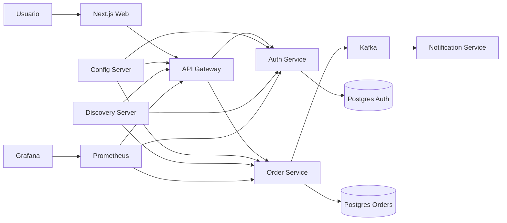

# Pedidos MS Lab

Projeto pratico de estudo de arquitetura de microservicos com Java e Spring Boot, com foco em aprendizado real de backend, cloud-native e integracao frontend.

## Visao Geral

Este monorepo implementa um sistema de pedidos com autenticacao e arquitetura de microservicos, incluindo:

- `auth-service` para cadastro, login e JWT
- `order-service` para criacao e gestao de pedidos
- `notification-service` como consumer Kafka
- `api-gateway` como ponto de entrada unico
- `discovery-server` com Eureka
- `config-server` para configuracao centralizada
- `apps/web` com frontend em Next.js
- observabilidade com Prometheus e Grafana
- testes de carga com k6

## Arquitetura



## Stack

- Java 21
- Spring Boot
- Spring Cloud Gateway
- Eureka Discovery
- Spring Cloud Config
- Spring Security + JWT
- PostgreSQL
- Apache Kafka
- Prometheus + Grafana
- React + Next.js
- k6
- Docker Compose
- GitHub Actions

## Estrutura do Monorepo

- [`C:\code_environment\workspace\pedidos-ms\auth-service`](C:\code_environment\workspace\pedidos-ms\auth-service)
- [`C:\code_environment\workspace\pedidos-ms\order-service`](C:\code_environment\workspace\pedidos-ms\order-service)
- [`C:\code_environment\workspace\pedidos-ms\notification-service`](C:\code_environment\workspace\pedidos-ms\notification-service)
- [`C:\code_environment\workspace\pedidos-ms\api-gateway`](C:\code_environment\workspace\pedidos-ms\api-gateway)
- [`C:\code_environment\workspace\pedidos-ms\config-server`](C:\code_environment\workspace\pedidos-ms\config-server)
- [`C:\code_environment\workspace\pedidos-ms\discovery-server`](C:\code_environment\workspace\pedidos-ms\discovery-server)
- [`C:\code_environment\workspace\pedidos-ms\apps\web`](C:\code_environment\workspace\pedidos-ms\apps\web)
- [`C:\code_environment\workspace\pedidos-ms\load-tests\k6`](C:\code_environment\workspace\pedidos-ms\load-tests\k6)
- [`C:\code_environment\workspace\pedidos-ms\docs`](C:\code_environment\workspace\pedidos-ms\docs)

## Como Rodar

### Subir tudo com Docker

```powershell
cd C:\code_environment\workspace\pedidos-ms
docker compose up --build -d
```

### Frontend

- Frontend: [http://localhost:3001](http://localhost:3001)
- Gateway: [http://localhost:8080](http://localhost:8080)
- Eureka: [http://localhost:8761](http://localhost:8761)
- Config Server: [http://localhost:8888](http://localhost:8888)
- Swagger Auth: [http://localhost:8081/swagger-ui/index.html](http://localhost:8081/swagger-ui/index.html)
- Swagger Orders: [http://localhost:8082/swagger-ui/index.html](http://localhost:8082/swagger-ui/index.html)
- Kafka UI: [http://localhost:9080](http://localhost:9080)
- Prometheus: [http://localhost:9090](http://localhost:9090)
- Grafana: [http://localhost:3000](http://localhost:3000)

## Testes

### Backend

```powershell
cd C:\code_environment\workspace\pedidos-ms
mvn test
```

### Smoke test automatizado

```powershell
powershell -ExecutionPolicy Bypass -File .\scripts\up-and-test.ps1 -Rebuild -KeepRunning
```

### Teste de carga com k6

```powershell
powershell -ExecutionPolicy Bypass -File .\scripts\run-k6.ps1 -Scenario smoke
powershell -ExecutionPolicy Bypass -File .\scripts\run-k6.ps1 -Scenario load
```

## Guia de Estudo

Se sua intencao e estudar e aprender a implementacao com profundidade, comece por estes arquivos:

- [`C:\code_environment\workspace\pedidos-ms\docs\GUIA_ESTUDO_COMPLETO.md`](C:\code_environment\workspace\pedidos-ms\docs\GUIA_ESTUDO_COMPLETO.md)
- [`C:\code_environment\workspace\pedidos-ms\docs\ROTEIRO_LEITURA_POR_ARQUIVO.md`](C:\code_environment\workspace\pedidos-ms\docs\ROTEIRO_LEITURA_POR_ARQUIVO.md)
- [`C:\code_environment\workspace\pedidos-ms\docs\LAB_PRATICO.md`](C:\code_environment\workspace\pedidos-ms\docs\LAB_PRATICO.md)

## CI

A pipeline esta em:

- [`C:\code_environment\workspace\pedidos-ms\.github\workflows\ci.yml`](C:\code_environment\workspace\pedidos-ms\.github\workflows\ci.yml)

## Objetivo do Projeto

Este projeto foi organizado como um laboratorio completo para estudar:

- microservicos com Spring Boot
- autenticacao JWT
- service discovery
- configuracao centralizada
- mensageria orientada a eventos
- observabilidade
- frontend moderno com Next.js
- testes de carga

## Licenca

Uso educacional e de estudo.
