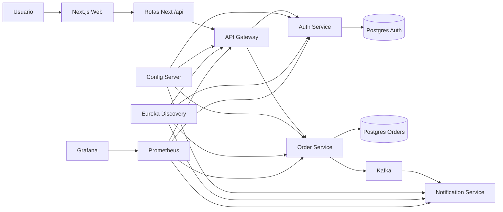
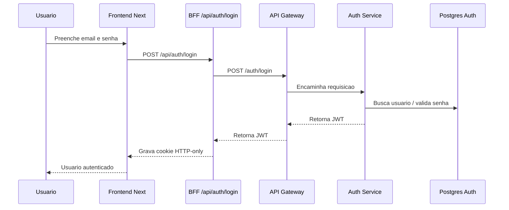
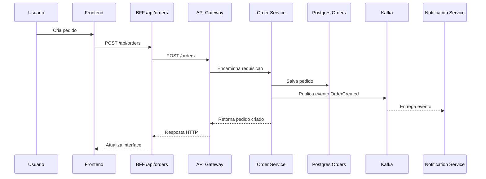
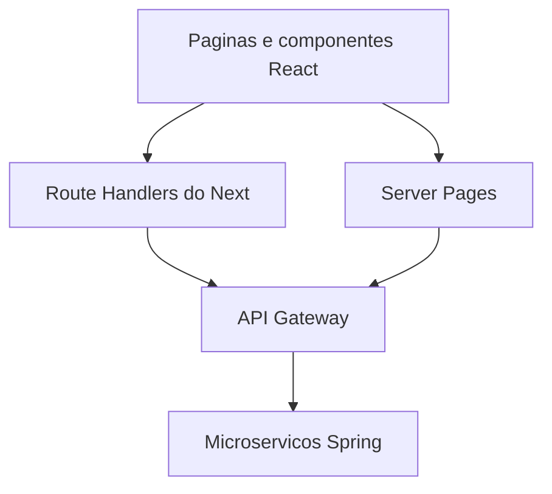

# Guia de Estudo Pareto do Monorepo `pedidos-ms`

Este guia foi escrito para te fazer aprender o projeto do jeito mais eficiente possivel.

A regra aqui e clara: **primeiro vamos estudar o 20% de conceitos que te dao 80% de dominio do sistema**. Depois disso, aprofundamos nas partes mais avancadas sem ficar perdido.

O objetivo nao e apenas te mostrar "o que foi implementado". O objetivo e te levar a um ponto em que voce consiga:

- entender a arquitetura
- navegar pelo codigo com seguranca
- explicar as decisoes tecnicas
- alterar features
- recriar um projeto parecido sozinho

---

## 1. O mapa mental do projeto

Se voce lembrar bem destas 6 ideias, ja entendeu boa parte do sistema:

1. O sistema e um **monorepo** com varios projetos dentro da mesma raiz.
2. O backend foi dividido em **microservicos**, cada um com uma responsabilidade.
3. O acesso externo passa pelo **API Gateway**.
4. A autenticacao usa **JWT**.
5. Os pedidos sao persistidos no banco e tambem geram **eventos Kafka**.
6. O frontend em **Next.js** funciona como uma camada web separada, mas dentro do mesmo monorepo.

Se essas 6 ideias estiverem claras, o resto comeca a encaixar.

---

## 2. Estrutura do monorepo

Projetos principais:

- `config-server`: centraliza configuracoes
- `discovery-server`: registro de servicos com Eureka
- `api-gateway`: ponto de entrada do backend
- `auth-service`: cadastro, login e JWT
- `order-service`: gestao de pedidos
- `notification-service`: consumer Kafka
- `apps/web`: frontend em Next.js
- `config-repo`: arquivos de configuracao centralizada
- `monitoring`: Prometheus e Grafana
- `scripts`: automacoes de subida e teste
- `postman`: collection para exercicios e testes manuais

Pensamento importante: o monorepo junta os projetos, mas **nao mistura responsabilidades**.

---

## 3. Diagrama principal da arquitetura

Leitura do desenho:

- o usuario nao fala direto com os microservicos; ele entra pelo frontend
- o frontend usa rotas proprias para intermediar chamadas ao backend
- o gateway decide para onde encaminhar cada requisicao
- `auth-service` cuida de identidade
- `order-service` cuida da regra de pedidos
- `notification-service` reage a eventos, em vez de receber chamada HTTP direta
- `config-server` e `discovery-server` sao servicos de infraestrutura

---

## 4. Ordem de estudo ideal

Use esta ordem. Ela segue Pareto: primeiro o que gera mais entendimento por unidade de esforco.

### Fase 1: Entender o fluxo completo

Estude primeiro:

- [`C:\code_environment\workspace\pedidos-ms\apps\web\app\login\page.tsx`](C:\code_environment\workspace\pedidos-ms\apps\web\app\login\page.tsx)
- [`C:\code_environment\workspace\pedidos-ms\apps\web\app\api\auth\login\route.ts`](C:\code_environment\workspace\pedidos-ms\apps\web\app\api\auth\login\route.ts)
- [`C:\code_environment\workspace\pedidos-ms\api-gateway\src\main\resources\application.yml`](C:\code_environment\workspace\pedidos-ms\api-gateway\src\main\resources\application.yml)
- [`C:\code_environment\workspace\pedidos-ms\auth-service\src\main\java`](C:\code_environment\workspace\pedidos-ms\auth-service\src\main\java)
- [`C:\code_environment\workspace\pedidos-ms\order-service\src\main\java`](C:\code_environment\workspace\pedidos-ms\order-service\src\main\java)

Meta desta fase:

- entender como um login acontece
- entender como o token chega no backend
- entender como um pedido e criado
- entender como esse pedido volta para a tela

Se voce dominar essa fase, ja entende o fluxo principal do produto.

### Fase 2: Entender a espinha dorsal da arquitetura

Estude depois:

- `config-server`
- `config-repo`
- `discovery-server`
- `docker-compose.yml`

Meta desta fase:

- entender como os servicos se encontram
- entender como eles recebem configuracao
- entender como tudo sobe junto

### Fase 3: Entender arquitetura orientada a eventos

Estude depois:

- produtor Kafka no `order-service`
- consumer Kafka no `notification-service`

Meta desta fase:

- entender por que eventos desacoplam o sistema
- entender a diferenca entre chamada HTTP sincrona e mensageria assincrona

### Fase 4: Entender operacao real

Estude por fim:

- healthchecks
- Prometheus
- Grafana
- GitHub Actions
- script `up-and-test.ps1`

Meta desta fase:

- entender como um sistema sai do codigo e vai para um ambiente executavel e observavel

---

## 5. O 20% de codigo que mais importa

Se eu tivesse que te ensinar esse projeto em poucas horas, eu focaria nesses pontos:

1. Controllers / routes: onde a requisicao entra.
2. Services: onde a regra de negocio mora.
3. Security config + JWT: onde o sistema decide quem pode fazer o que.
4. Repositories: onde a aplicacao salva e consulta dados.
5. Gateway routes: onde o trafego e distribuido.
6. BFF do Next.js: onde o frontend protege token e conversa com o backend.

O erro mais comum de quem esta estudando e gastar muito tempo cedo demais com detalhe de framework. Antes disso, entenda o fluxo.

Pergunta de ouro para todo arquivo que voce abrir:

**"Esse arquivo participa de que etapa do fluxo?"**

---

## 6. Fluxo de autenticacao explicado do zero

### O que voce precisa aprender aqui

- o frontend nao guarda token em `localStorage`
- o Next cria uma camada intermediaria para lidar com autenticacao
- o `auth-service` autentica e assina um JWT
- os outros servicos confiam nesse token para autorizar acesso

### Conceitos essenciais

#### Controller
Recebe a chamada HTTP.

#### Service
Executa a regra de negocio, por exemplo validar credenciais.

#### Repository
Busca ou salva no banco.

#### DTO
Objeto usado para entrada e saida da API.

#### JWT
Token assinado que carrega identidade do usuario.

### O que olhar no codigo

No `auth-service`, normalmente a trilha mental e:

1. controller recebe login
2. service valida usuario e senha
3. componente JWT gera token
4. resposta volta ao cliente

Ao estudar, tente reconstruir esse caminho manualmente.

---

## 7. Fluxo de pedidos explicado do zero

### O que voce precisa aprender aqui

- o pedido e uma entidade de negocio
- o banco garante persistencia
- o Kafka permite que outras partes reajam ao evento
- a notificacao nao precisa ficar acoplada ao `order-service`

### Por que isso e bom?

Se amanha voce quiser adicionar:

- faturamento
- envio de email
- analytics
- auditoria

voce pode criar novos consumers de evento sem quebrar o fluxo principal do pedido.

Esse e um dos maiores ganhos de arquitetura orientada a eventos.

---

## 8. Backend: o papel de cada servico

## 8.1 `auth-service`

Responsabilidade: identidade e autenticacao.

O que ele faz:

- cadastra usuario
- autentica login
- gera JWT
- protege endpoints autenticados

O que aprender no codigo:

- entidades JPA
- repositories Spring Data
- services de autenticacao
- encoder de senha
- filtro ou utilitario JWT
- configuracao do Spring Security

Perguntas que voce precisa saber responder:

- onde a senha e criptografada?
- onde o token e criado?
- onde o token e validado?
- como um endpoint publico e diferente de um endpoint protegido?

## 8.2 `order-service`

Responsabilidade: pedidos.

O que ele faz:

- cria pedidos
- lista pedidos
- atualiza status
- publica eventos Kafka

O que aprender no codigo:

- entidade de pedido
- enum de status
- service com regra de negocio
- repository com consultas
- publisher Kafka
- seguranca baseada no JWT

Perguntas importantes:

- quem pode criar pedido?
- quem pode listar pedido?
- como o usuario autenticado e identificado?
- em que ponto o evento Kafka e emitido?

## 8.3 `notification-service`

Responsabilidade: consumir eventos.

O que ele faz:

- escuta topicos Kafka
- processa eventos de pedido
- demonstra arquitetura assincrona

O que aprender:

- diferenca entre producer e consumer
- desserializacao de mensagens
- idempotencia como preocupacao futura
- tolerancia a falhas em consumo de eventos

## 8.4 `api-gateway`

Responsabilidade: entrada unica do backend.

O que ele faz:

- recebe chamadas externas
- roteia por path
- simplifica o acesso aos servicos

Por que ele existe?

Sem gateway, o cliente teria que conhecer varios servicos e portas. Com gateway, o cliente fala com um unico ponto de entrada.

O que aprender:

- definicao de rotas
- filtros
- estrategia de exposicao de endpoints
- relacao entre gateway e discovery

## 8.5 `discovery-server`

Responsabilidade: registro de servicos.

Ele usa Eureka.

Por que isso existe?

Em ambiente distribuido, servicos podem subir, cair, mudar endereco. O discovery server cria um catalogo vivo de onde cada servico esta.

Mentalidade certa:

- sem discovery: configuracao mais estatica
- com discovery: mais flexibilidade operacional

## 8.6 `config-server`

Responsabilidade: configuracao centralizada.

O que aprender:

- externalizacao de propriedades
- diferenca entre configuracao e codigo
- como um servico busca sua configuracao ao iniciar
- por que isso ajuda em ambientes diferentes

---

## 9. Frontend Next.js: o que realmente importa aprender

O frontend foi separado em [`C:\code_environment\workspace\pedidos-ms\apps\web`](C:\code_environment\workspace\pedidos-ms\apps\web), o que e uma pratica comum de mercado mesmo dentro de monorepo.

### Arquitetura do frontend

### Por que Next.js aqui?

Porque ele te permite juntar 3 papeis no mesmo projeto:

- interface React
- backend leve para BFF
- renderizacao no servidor quando fizer sentido

### O 20% mais importante do front

1. App Router
2. diferenca entre Server Components e Client Components
3. Route Handlers em `app/api`
4. cookies HTTP-only
5. fetch para o gateway
6. estado de formulario e renderizacao de lista

### Arquivos mais importantes para estudar

- [`C:\code_environment\workspace\pedidos-ms\apps\web\app\page.tsx`](C:\code_environment\workspace\pedidos-ms\apps\web\app\page.tsx)
- [`C:\code_environment\workspace\pedidos-ms\apps\web\app\login\page.tsx`](C:\code_environment\workspace\pedidos-ms\apps\web\app\login\page.tsx)
- [`C:\code_environment\workspace\pedidos-ms\apps\web\app\dashboard\page.tsx`](C:\code_environment\workspace\pedidos-ms\apps\web\app\dashboard\page.tsx)
- [`C:\code_environment\workspace\pedidos-ms\apps\web\app\api\auth\login\route.ts`](C:\code_environment\workspace\pedidos-ms\apps\web\app\api\auth\login\route.ts)
- [`C:\code_environment\workspace\pedidos-ms\apps\web\app\api\orders\route.ts`](C:\code_environment\workspace\pedidos-ms\apps\web\app\api\orders\route.ts)
- [`C:\code_environment\workspace\pedidos-ms\apps\web\components\dashboard-client.tsx`](C:\code_environment\workspace\pedidos-ms\apps\web\components\dashboard-client.tsx)
- [`C:\code_environment\workspace\pedidos-ms\apps\web\lib\backend.ts`](C:\code_environment\workspace\pedidos-ms\apps\web\lib\backend.ts)

### Como pensar esse frontend

#### `app/page.tsx`
E a porta de entrada da aplicacao.

#### `app/login/page.tsx` e `app/register/page.tsx`
Controlam formularios e chamam as rotas internas do Next.

#### `app/api/auth/*`
Funcionam como BFF. Elas recebem a chamada do browser, conversam com o backend real e controlam cookie/token.

#### `app/dashboard/page.tsx`
Busca dados de pedidos e entrega para a interface.

#### `dashboard-client.tsx`
Cuida da interacao no navegador: formulario, submissao, atualizacao visual.

### O que aprender no codigo do front

- quando usar server-side e quando usar client-side
- como encapsular chamadas HTTP
- como evitar expor token no browser
- como organizar componentes, paginas e utilitarios
- como uma tela conversa com uma API protegida

---

## 10. Configuracao, descoberta e inicializacao

Essas partes costumam assustar no inicio, mas a ideia central e simples.

### `config-repo`

E um repositorio de configuracoes. Em vez de cada servico carregar tudo localmente, o `config-server` entrega isso centralizado.

### `bootstrap` / `application`

No ecossistema Spring Cloud, varios servicos buscam configuracoes ao iniciar. Isso te obriga a pensar em ordem de subida.

### `docker-compose.yml`

Ele e praticamente o "mapa operacional" do projeto.

O que estudar nele:

- servicos definidos
- portas publicadas
- variaveis de ambiente
- dependencias entre containers
- healthchecks

### Healthchecks

Eles existem para responder: "esse servico realmente esta pronto para atender?"

Subir container nao significa estar saudavel. Esse e um aprendizado muito importante de engenharia real.

---

## 11. Kafka sem misterio

Kafka entra aqui para mostrar integracao orientada a eventos.

### O que e um producer?

Quem publica a mensagem.

No projeto: `order-service`.

### O que e um consumer?

Quem escuta e processa a mensagem.

No projeto: `notification-service`.

### Quando usar HTTP e quando usar evento?

Use HTTP quando:

- voce precisa de resposta imediata
- o fluxo e requisicao/resposta
- o cliente depende do retorno naquele momento

Use evento quando:

- outras partes so precisam reagir depois
- voce quer desacoplar servicos
- voce quer permitir expansao futura sem alterar o fluxo principal

### Conceito de Pareto aqui

Para aprender o suficiente sem se perder, foque primeiro em:

1. quem publica
2. qual payload vai
3. qual topico recebe
4. quem consome
5. o que o consumer faz com a mensagem

Nao comece estudando tuning de particao, retention ou cluster avancado. Isso vem depois.

---

## 12. Banco de dados e modelo mental

Voce tem dois bancos Postgres separados:

- um para autenticacao
- um para pedidos

Isso reforca o principio de microservicos: **cada servico dono do proprio dado**.

### Por que isso e importante?

Porque reduz acoplamento.

Se dois servicos compartilham o mesmo banco sem disciplina, a separacao arquitetural fica falsa.

### O que aprender primeiro em JPA

1. entidade
2. chave primaria
3. mapeamento de colunas
4. repository
5. persistencia via service

Antes de estudar otimizacao de ORM, entenda esse basico muito bem.

---

## 13. Seguranca: o que realmente precisa dominar

Voce nao precisa virar especialista em Spring Security logo de cara. Mas precisa dominar estes pontos:

1. endpoints publicos vs privados
2. autenticacao vs autorizacao
3. password encoder
4. JWT
5. filtro ou mecanismo de validacao do token
6. `SecurityFilterChain`

### Diferenca importante

- autenticacao: provar quem voce e
- autorizacao: decidir o que voce pode fazer

### Perguntas para revisar

- em que endpoint o usuario faz login?
- onde a senha e comparada?
- onde o token e criado?
- como o `order-service` descobre quem e o usuario autenticado?

Se voce souber responder isso olhando o codigo, esta indo muito bem.

---

## 14. Observabilidade e operacao

Essas partes te aproximam do mundo real.

### Prometheus

Coleta metricas.

### Grafana

Exibe dashboards.

### Actuator

Exponibiliza endpoints de health e metricas.

### O que aprender primeiro

1. o que e `/actuator/health`
2. o que e `/actuator/prometheus`
3. como o Prometheus faz scrape
4. como o Grafana consome o Prometheus

Isso ja te da uma base muito boa.

---

## 15. Testes e CI

### Testes

O projeto ja tem testes unitarios em partes importantes do backend.

O que aprender:

- o que esta sendo isolado
- o que esta sendo mockado
- por que testar service costuma trazer mais valor cedo do que testar detalhe de framework

### CI com GitHub Actions

A pipeline serve para automatizar validacoes.

Aprendizados principais:

- instalar dependencias
- rodar testes
- falhar cedo quando algo quebra

Nao estude CI como se fosse so YAML. Pense nela como uma regra automatica de confianca do projeto.

---

## 16. Como estudar na pratica sem travar

Use este metodo em cada modulo:

1. leia a classe principal do projeto
2. descubra os controllers/routes
3. siga para os services
4. veja os repositories e entidades
5. execute a aplicacao
6. chame os endpoints
7. volte ao codigo e reconstrua o fluxo

Esse metodo e simples e funciona muito bem.

---

## 17. Plano de estudo de 7 dias usando Pareto

## Dia 1

Objetivo: entender o fluxo completo de login e pedido.

Estude:

- frontend login
- route handler de login
- gateway
- auth-service
- order-service

Entregavel:

- conseguir explicar o fluxo ponta a ponta sem olhar anotacao

## Dia 2

Objetivo: dominar Spring Security + JWT no contexto do projeto.

Entregavel:

- conseguir explicar autenticacao, autorizacao e validacao do token

## Dia 3

Objetivo: dominar JPA e persistencia dos servicos.

Entregavel:

- conseguir explicar como usuario e pedido sao salvos e consultados

## Dia 4

Objetivo: dominar Next.js no projeto.

Entregavel:

- conseguir explicar App Router, route handlers, cookies e dashboard

## Dia 5

Objetivo: dominar gateway, discovery e config server.

Entregavel:

- conseguir explicar por que esses servicos existem e quando fazem sentido

## Dia 6

Objetivo: dominar Kafka e notificacao.

Entregavel:

- conseguir explicar producer, consumer e desacoplamento

## Dia 7

Objetivo: dominar operacao.

Estude:

- Docker Compose
- healthchecks
- Prometheus
- Grafana
- CI
- script de automacao

Entregavel:

- conseguir subir tudo, testar e explicar como monitorar

---

## 18. Exercicios que mais ensinam

Se quiser aprender de verdade, faca estes exercicios na ordem.

1. Adicione um campo novo em `Order` e propague do banco ate a tela.
2. Crie um endpoint `me` no backend e mostre os dados do usuario logado no frontend.
3. Adicione um novo status de pedido e ajuste backend + frontend.
4. Crie um novo consumer Kafka para auditoria.
5. Proteja um endpoint novo com role/permissao.
6. Adicione um grafico simples no Grafana para volume de pedidos.

Cada um desses exercicios ensina arquitetura, nao so sintaxe.

---

## 19. Checklist de dominio

Voce vai saber que aprendeu bem quando conseguir responder, sem decorar:

- por que existe um gateway?
- por que existe um discovery server?
- por que existe um config server?
- como o login funciona?
- como o token e protegido no frontend?
- como o pedido e salvo?
- como o evento Kafka e publicado?
- como o consumer reage?
- por que cada servico tem seu proprio banco?
- como monitorar se o sistema esta saudavel?
- como o CI ajuda a evitar regressao?

Se voce responde isso com seguranca, seu entendimento ja saiu do nivel superficial.

---

## 20. O que estudar depois deste projeto

Depois de dominar esse monorepo, a progressao natural e:

1. refresh token
2. roles e autorizacao mais refinada
3. testes de integracao
4. tracing distribuido
5. resiliencia com retry/circuit breaker
6. versionamento de eventos
7. deploy em Kubernetes
8. banco por ambiente e secrets manager

Esses sao os proximos 20% que elevam muito o nivel.

---

## 21. Conclusao

A melhor forma de aprender esse projeto nao e decorar classe por classe. E construir um mapa mental claro:

- quem entra com a requisicao
- quem autentica
- quem roteia
- quem salva
- quem publica evento
- quem consome
- quem exibe na tela
- quem monitora tudo

Se voce estudar nessa ordem, vai aprender com muito mais velocidade e muito menos desgaste.

Se eu resumisse tudo em uma frase, seria esta:

**primeiro entenda o fluxo; depois entenda os blocos; por ultimo aprofunde a infraestrutura.**
